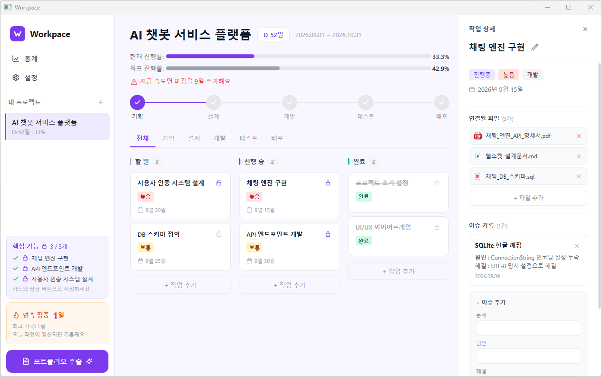

# Workpace

> 프로젝트를 시작부터 포트폴리오까지, 혼자서도 끝까지 완주하도록


<br>

## 📌 프로젝트 개요

Workpace는 혼자 프로젝트를 진행하는 개발자가 **작업을 끝까지 완주하고, 완료된 기록을 포트폴리오로 자동 변환**할 수 있도록 만든 WPF 기반 데스크톱 애플리케이션입니다.

> "앱을 쓰는 것 자체가 기록이 된다. 따로 정리하지 않아도 포트폴리오가 완성된다."

| 항목 | 내용 |
|------|------|
| 개발 기간 | 2026.05 ~ 2026.06 |
| 개발 인원 | 1인 (개인 프로젝트) |
| 플랫폼 | Windows 데스크톱 |

<br>

## 🛠 기술 스택

| 분류 | 기술 | 선정 이유 |
|------|------|-----------|
| 언어 | C# | WPF와 호환성이 좋고 강타입으로 대규모 UI 로직 관리에 적합 |
| UI 프레임워크 | WPF (.NET) | XAML 기반 선언적 UI와 데이터 바인딩으로 MVVM 패턴 적용에 최적 |
| 아키텍처 | MVVM (CommunityToolkit.Mvvm) | UI와 비즈니스 로직 분리, 소스 생성기로 보일러플레이트 최소화 |
| 데이터베이스 | SQLite (Microsoft.Data.Sqlite) | 서버 없이 로컬 파일 하나로 데이터 영속성 구현 가능 |
| PDF 생성 | PdfSharp-MigraDoc-GDI | .NET 환경에서 코드로 PDF 레이아웃 직접 제어 가능 |
| 차트 | LiveChartsCore.SkiaSharpView.WPF | WPF 바인딩 기반으로 차트를 선언적으로 구성 가능 |

<br>

## 🏗 아키텍처

MVVM 패턴으로 View / ViewModel / Service / Database 레이어를 분리했습니다.

```
Views (XAML)
  ↕ Data Binding / Command
ViewModels (C#)
  ↕ 데이터 요청 / 반환
Services (C#)              Models (C#)
  DatabaseService            Project / WorkTask / Issue
  PortfolioService           Streak / UserProfile
  NotificationService
  ↕
SQLite DB
  Projects · Tasks · Issues · Files · Streaks · UserProfile
```

- `[ObservableProperty]` 소스 생성기로 PropertyChanged 자동 처리
- `WeakReferenceMessenger`로 ViewModel 간 통신 (메모리 누수 방지)
- `partial void On{Property}Changed` 훅으로 설정값 변경 시 DB 즉시 저장

<br>

## ⚙️ 핵심 기능

### 1. 칸반 보드 & 작업 관리
할 일 / 진행 중 / 완료 3컬럼 구조의 칸반 보드에서 드래그앤드롭으로 작업 상태를 관리합니다.
기획 / 설계 / 개발 / 테스트 / 배포 단계별 탭 필터로 현재 집중할 단계의 작업만 모아볼 수 있습니다.



- WPF DragDrop API 직접 구현 (`PreviewMouseMove` → `DoDragDrop()` → `Column_Drop()`)
- `_isDragReady` / `_wasDragging` 플래그로 단순 클릭과 드래그 구분
- 드롭 완료 후 작업 상세 패널 자동 갱신 (`SelectTaskCommand` 체이닝)

### 2. 페이스 경고 시스템
목표 진행률(경과일 / 전체 기간 × 100)과 실제 진행률(완료 작업 수 / 전체 작업 수 × 100)을 비교해 현재 속도가 마감에 맞는지 경고합니다.

- 목표 대비 현재 진행률이 낮으면 빨간 경고 텍스트와 D-day 배지로 시각화
- 하루 1회 오후 9시 스트릭 리마인더 알림 발송
- 프로젝트/작업 마감 3일 이내 자동 알림 (앱 실행 시 1회 체크)
- UWP 패키지 WPF 비호환 문제로 `AllowsTransparency=True` 커스텀 Window 기반 토스트 직접 구현

### 3. 스코프 잠금
핵심 기능 태스크에 자물쇠를 걸어 스코프를 고정합니다. 잠긴 태스크는 사이드바 핵심 기능 섹션에 항상 노출되어 방향성을 유지할 수 있습니다.

- Task에 `IsCore` bool + `CoreLockedAt` DateTime? 필드로 구현
- 자물쇠 아이콘 클릭 → `ToggleCoreLockCommand` → DB 즉시 저장
- `IsCore` 값에 따라 Lucide SVG Path 기반 잠금/잠금해제 아이콘 전환

### 4. 이슈 기록 & 트러블슈팅 자동화
작업 카드 안에서 즉시 이슈를 기록하면 문제 / 원인 / 해결 / 결과 구조로 DB에 누적됩니다. 포트폴리오 추출 시 트러블슈팅 섹션으로 자동 반영됩니다.

- `Issues` 테이블: `TaskId(FK) / Problem / Cause / Solution / Result / CreatedAt`
- 이슈 수정/삭제 지원, 작업 삭제 시 FK cascade로 연계 삭제

### 5. 스트릭 시스템
매일 작업을 완료하면 연속 작업일(스트릭)이 카운트됩니다. GitHub 잔디와 유사한 365일 활동 히트맵으로 꾸준함을 시각화합니다.

- `Streaks` 테이블 `UNIQUE(Date)` + `INSERT OR IGNORE` → 하루 1회만 카운트
- Canvas가 ItemsControl 내부에서 너비 0으로 collapse되는 WPF 제약으로 월 헤더를 코드비하인드에서 직접 렌더링

### 6. 포트폴리오 자동 생성
프로젝트 완료 후 버튼 하나로 PDF 포트폴리오 문서가 자동 생성됩니다.

- **자동 수집**: 프로젝트 기간 / 완료 작업 수 / 최고 스트릭 / 일정 준수율 / 트러블슈팅 이력
- **최초 1회 입력**: 기술 스택 선정 이유 / GitHub URL / 개발 배경 / 회고
- MigraDoc으로 Document 구조 생성 → PdfSharp으로 PDF 렌더링
- `SaveFileDialog`로 저장 위치 직접 선택, 포함할 섹션을 체크박스로 선택 가능

<br>

## 🚧 트러블슈팅

| 문제 | 원인 | 해결 |
|------|------|------|
| DatePicker 커스텀 스타일 미적용 | WPF 테마가 내부 스타일 덮어씀 | Button + Popup + Calendar 조합의 CustomDatePicker UserControl 직접 구현 |
| Windows 토스트 알림 WPF 비호환 | UWP 전용 패키지, WPF에서 Show() 없음 | AllowsTransparency=True 커스텀 Window 기반 토스트 직접 구현 |
| 통계 히트맵 Canvas 너비 0 | Canvas가 ItemsControl 내부에서 크기 미인식 | 코드비하인드에서 TextBlock 동적 생성으로 월 헤더 직접 렌더링 |
| 모델 변경이 UI에 미반영 | auto-property는 PropertyChanged 미발생 | ObservableObject 상속 + [ObservableProperty] 적용 |

<br>

## 📂 프로젝트 구조

```
Workpace/
├── Models/
│   ├── Project.cs
│   ├── WorkTask.cs
│   ├── Issue.cs
│   ├── Streak.cs
│   └── UserProfile.cs
├── ViewModels/
│   ├── MainViewModel.cs
│   ├── ProjectViewModel.cs
│   ├── StatisticsViewModel.cs
│   └── SettingsViewModel.cs
├── Views/
│   ├── MainWindow.xaml
│   ├── ProjectView.xaml
│   ├── StatisticsView.xaml
│   ├── PortfolioView.xaml
│   ├── SettingsView.xaml
│   └── CustomDatePicker.xaml
├── Services/
│   ├── DatabaseService.cs
│   ├── PortfolioService.cs
│   └── NotificationService.cs
└── App.xaml
```

<br>

## 🗄 DB 구조

```
Projects    : Id / Name / StartDate / Deadline / Description / GitHubUrl / TechStack
Tasks       : Id / ProjectId(FK) / Title / Status / Priority / DueDate / Stage / IsCore
Issues      : Id / TaskId(FK) / Problem / Cause / Solution / Result / CreatedAt
Files       : Id / TaskId(FK) / FileName / FilePath
Streaks     : Id / Date / WorkDone   (UNIQUE Date)
UserProfile : Id / Name / Email / LinkedIn / Blog / Bio
```

<br>

## 🎬 시연 영상

[](https://www.youtube.com/watch?v=5smDx6y9e8E)
