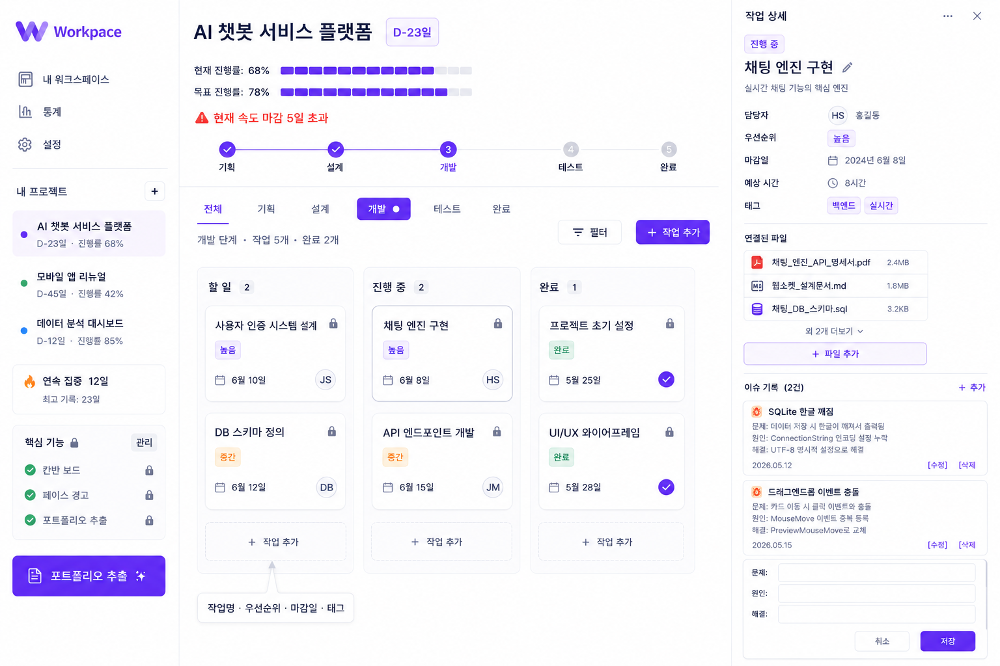

# Workpace

혼자 하는 프로젝트를 끝까지 완주하도록 페이스를 잡아주고,
완료 시 포트폴리오까지 자동 생성되는 WPF 기반 데스크톱 앱

## 기술 스택
- Language: C#
- Framework: WPF (.NET)
- DB: SQLite
- Architecture: MVVM Pattern

## 핵심 기능
- 템플릿 시스템
- 페이스 경고
- 스코프 잠금
- 이슈 기록
- 포트폴리오 자동 생성

## 화면 미리보기
